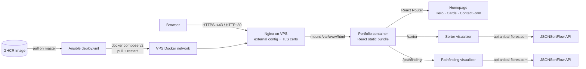

# Portfolio

A containerized React portfolio that serves a bilingual, theme-aware personal site and hosts the sorter and pathfinding visualizers consumed by the wider self-hosted stack.

[](https://github.com/Deadlici0us/portfolio/actions)
[](https://reactjs.org/)
[](https://www.docker.com/)
[](https://nginx.org/)
[](https://anibal-flores.com/)
[](#license)

The application is a static single-page app built from React 18 and served by Nginx inside a multi-stage Docker image; the production server, TLS certificates, and Compose network are supplied by the VPS outside this repository.

---

## Features

| Feature | Description |
| --- | --- |
| React SPA | React 18 with `react-router-dom` for client-side navigation between the home, sorter, and pathfinding pages |
| Bilingual UI | `i18next` plus `i18next-browser-languagedetector` for English/Spanish language detection and switching |
| Visualizer pages | `/sorter` and `/pathfinding` embed the algorithm visualizers that call the backend services |
| Theme persistence | Light/dark theme stored in `localStorage` and exposed through `ThemeContext` |
| Containerized delivery | Multi-stage Docker build produces a small Nginx image that serves the static bundle on ports 80 and 443 |
| Self-hosted deployment | GitHub Actions builds and pushes the image to GHCR; Ansible pulls it on the VPS and restarts the Compose stack |
| TLS at the edge | Nginx terminates HTTPS using certificates mounted from the server; certificates are not stored in this repository |

---

## Technical Highlights

### 1. Static delivery pipeline

The production path is deliberately simple: `npm run build` emits the static bundle, the Docker builder copies it into an Alpine image, and Nginx serves the resulting files without a Node runtime in the production stage.

- **Multi-stage image:** `node:lts-alpine` builds the app, then `alpine:latest` runs only Nginx and the static assets.
- **No runtime secrets:** the image contains no application credentials; TLS material and service configuration are mounted at deploy time.
- **Health surface:** the container exposes `80` and `443` and runs Nginx in the foreground so the orchestrator can supervise it directly.

### 2. External-mount deployment contract

This repository owns the application image; the VPS owns the edge configuration. The server mounts the Nginx configuration, certificate directory, and shared Compose network into the container at runtime.

- **External `nginx.conf`:** server blocks, TLS, and proxy rules live on the VPS and are mounted into `/etc/nginx/`; they are intentionally absent from the image.
- **External certificates:** `fullchain.pem` and `privkey.pem` are provided by the host and must never be committed.
- **Shared network:** the portfolio container joins the VPS Docker network used by the API services and databases.

### 3. Bilingual, theme-aware frontend

The UI is organized as a small component tree rather than a monolithic page, with routing and state kept close to the features they serve.

- **Routing:** `BrowserRouter` maps `/` to the portfolio home, `/sorter` to the sorting visualizer, and `/pathfinding` to the grid-search visualizer (`App.tsx:53-57`).
- **Internationalization:** `i18next` and the browser language detector provide language switching without a server round-trip.
- **Theme state:** `ThemeContext` persists the selected theme in `localStorage`; the default is dark when no preference exists.

---

## System Architecture

The request path is a static-asset edge: the browser receives the built bundle from Nginx, while the visualizer pages call the backend services over the shared VPS network.



---

## Project Structure

```text
portfolio/
├── src/
│   ├── App.tsx                 # Router, theme provider, i18n shell
│   ├── App.css                 # Global layout and background animation
│   ├── i18n.tsx                # i18next setup and translations
│   ├── index.tsx               # React entry point
│   └── components/
│       ├── Navbar.tsx          # Navigation and route links
│       ├── Hero.tsx            # Portfolio introduction
│       ├── Cards.tsx           # Project cards
│       ├── ContactForm.tsx     # EmailJS contact form
│       ├── Footer.tsx          # Footer
│       ├── ThemeContext.tsx    # Persisted light/dark theme
│       ├── Sorter.tsx          # Sorting visualizer page
│       └── Pathfinding.tsx     # Grid-search visualizer page
├── public/                     # Static assets copied by CRA
├── Dockerfile                  # Multi-stage build → Nginx
├── deploy.yml                  # Ansible Compose pull/restart
├── .github/workflows/main.yml  # Build, push GHCR, deploy
└── package.json                # React 18 scripts and dependencies
```

Key frontend modules:

- **`src/App.tsx`** — wraps the app in `ThemeProvider` and `I18nextProvider`, then defines the three routes.
- **`src/components/Sorter.tsx`** — page that renders the sorting visualizer and calls the sorter API.
- **`src/components/Pathfinding.tsx`** — page that renders the grid-search visualizer and calls the search API.
- **`src/components/ThemeContext.tsx`** — persisted theme state shared by the shell and visualizers.
- **`src/i18n.tsx`** — language resources and detector configuration.
- **`Dockerfile`** — builds the React bundle, then serves it from Nginx on Alpine.

---

## Routes

The frontend exposes three client-side routes; the backend calls are handled by the JSONSortFlow service documented in that repository.

| Route | Component | Purpose |
| --- | --- | --- |
| `/` | `Homepage` (`Hero`, `Cards`, `ContactForm`) | Portfolio landing page |
| `/sorter` | `Sorter` | Sorting algorithm visualizer |
| `/pathfinding` | `Pathfinding` | Grid pathfinding visualizer |

The API contract used by the visualizers is:

| Endpoint | Method | Purpose |
| --- | --- | --- |
| `/bubble-sort` | `POST` | Sorting trace with `steps` and `indexes` |
| `/quick-sort` | `POST` | Sorting trace with `steps` and `indexes` |
| `/merge-sort` | `POST` | Sorting trace with `steps` and `indexes` |
| `/bfs-search` | `POST` | Breadth-first grid search (`explored`, `result`) |
| `/astar-search` | `POST` | A* grid search (`explored`, `result`) |
| `/dfs-search` | `POST` | Depth-first grid search (`explored`, `result`) |
| `/dijkstra-search` | `POST` | Dijkstra grid search (`explored`, `result`) |

---

## Configuration

The application has no required runtime environment variables. Deployment-time values are supplied by the VPS Compose stack and external Nginx mount.

| Variable | Default | Description |
| --- | --- | --- |
| `PORT` | — | Not used by the static image; Nginx listens on 80/443 |
| TLS certificate mount | — | External host path mounted into the Nginx container |
| Nginx config mount | — | External `nginx.conf` supplied by the VPS |
| Docker network | — | External Compose network shared with backend services |

---

## Building and Running

### Prerequisites

- **Node.js 18+** and npm
- **Docker** for the container image
- **Ansible** and Docker Compose v2 on the VPS for deployment

### Local run

```bash
npm install
npm start
```

The development server is available at `http://localhost:3000`.

### Production build

```bash
npm run build
npm run test -- --watchAll=false
```

### Docker

```bash
docker build -t portfolio .
docker run --rm -p 8080:80 -p 8443:443 portfolio
```

The image serves the static bundle; TLS certificates and the production Nginx configuration are still supplied by the VPS mount.

### Deployment

```bash
ansible-playbook deploy.yml
```

The workflow builds and pushes the image to GHCR on `master`, then Ansible pulls the image and restarts the Compose services on the VPS.

---

## License

MIT License — see [LICENSE](LICENSE).